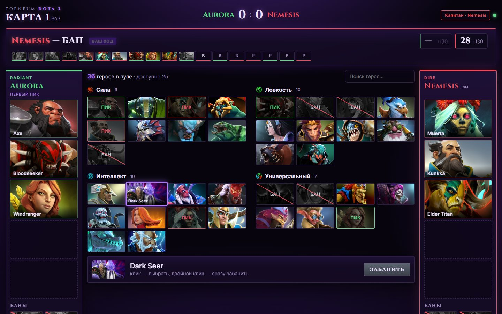
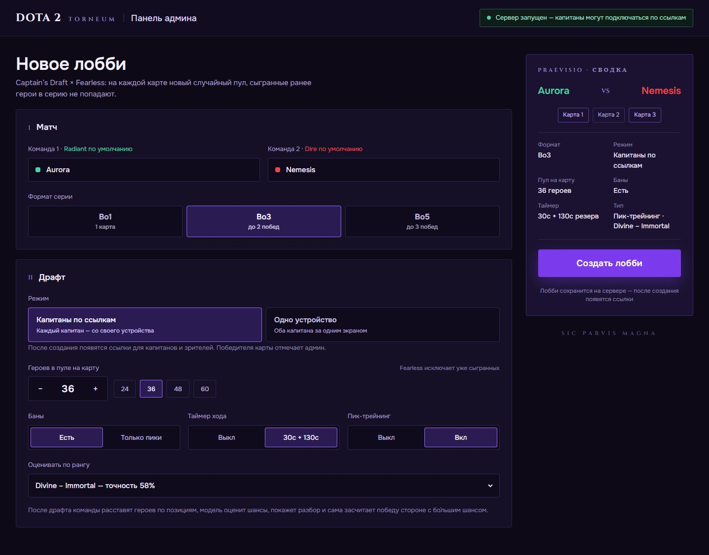
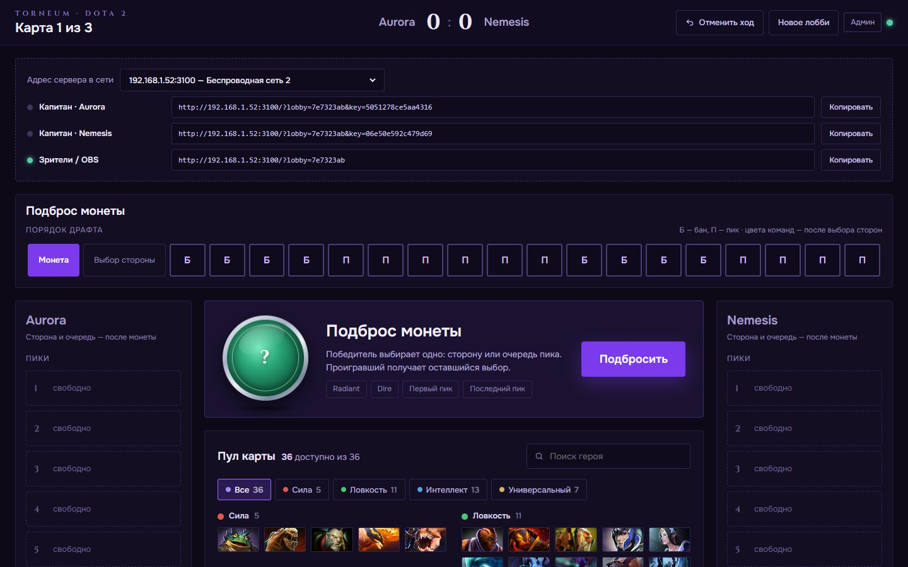
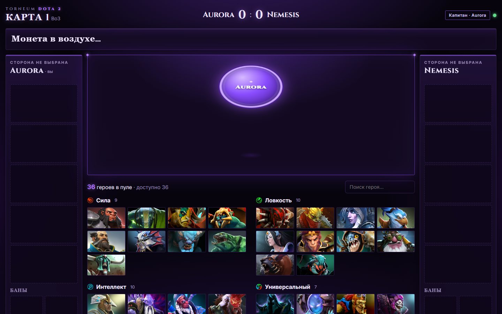
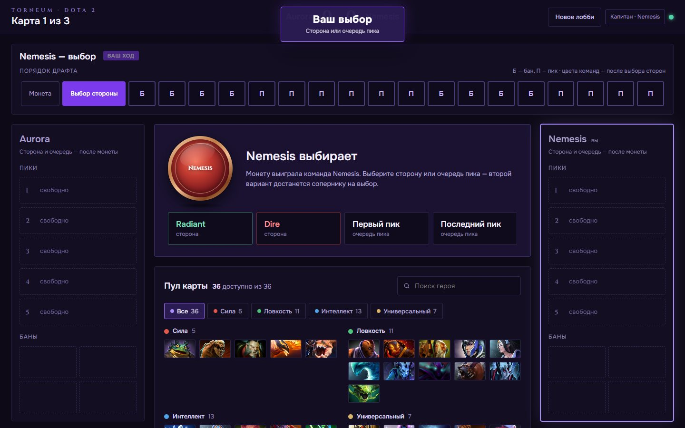
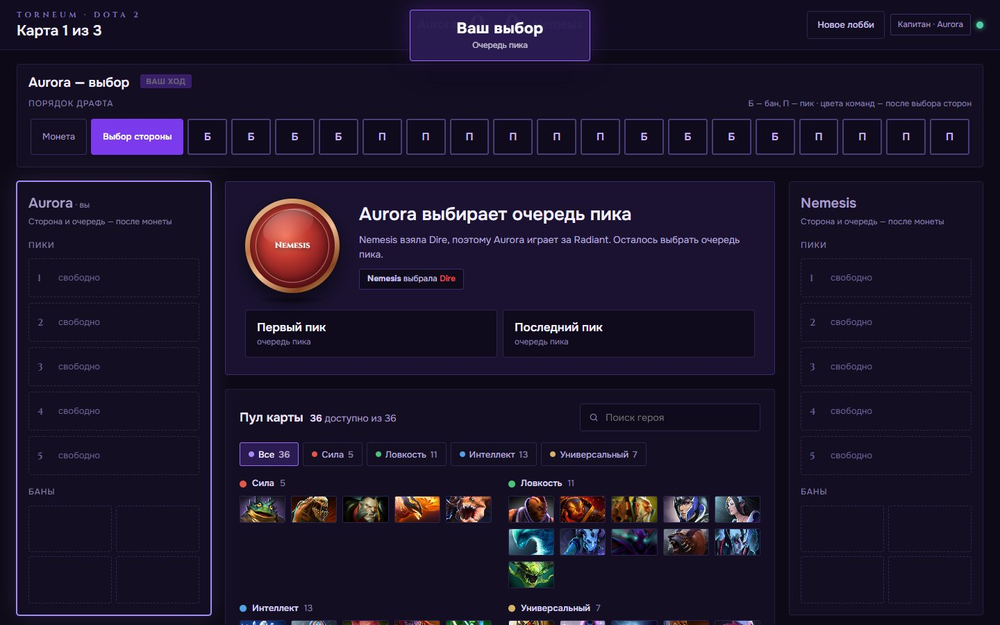
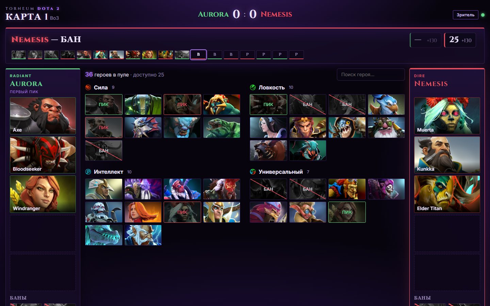
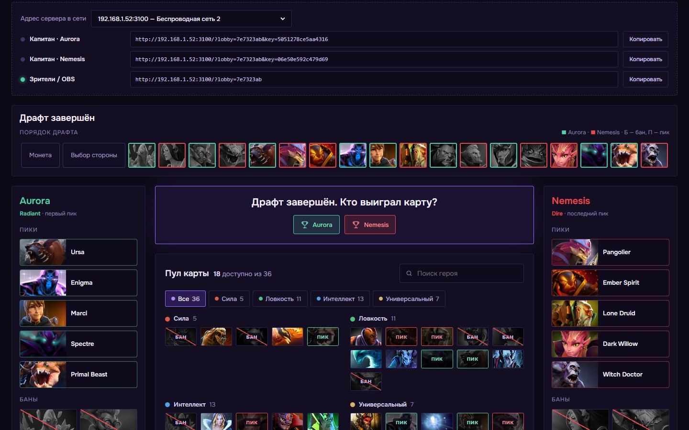
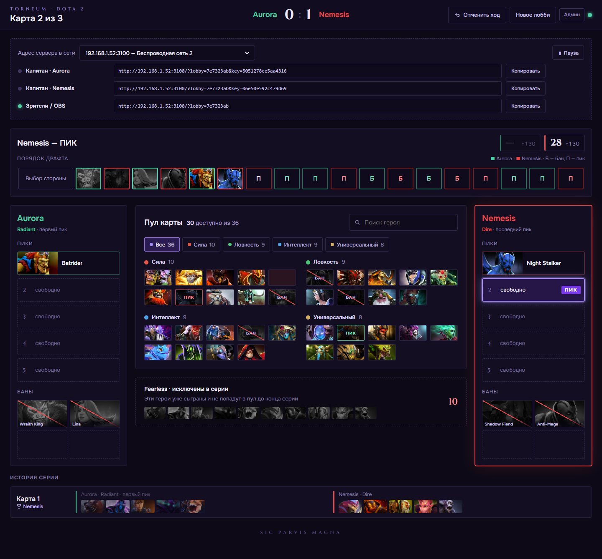
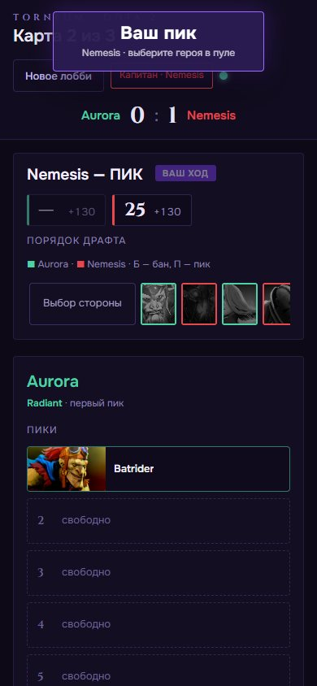

<div align="center">

# Torneum Dota 2 — драфт Captain's Draft × Fearless

**Веб-пикер для турниров по Dota 2: админ-панель, отдельные ссылки для капитанов, подброс монеты,
выбор стороны и очереди пика, Fearless-пул. Работает в локальной сети — без хостинга и регистрации.**

*Virtus ◆ Strategia ◆ Victoria*

[Демо](https://rabbau.github.io/DotaPicker/) ·
[Быстрый старт](#быстрый-старт) ·
[Инструкция для турнира](#запуск-в-локальной-сети--пошаговая-инструкция) ·
[Правила драфта](#правила-драфта) ·
[Частые вопросы](#частые-вопросы)



</div>

---

## Содержание

- [Возможности](#возможности)
- [Скриншоты](#скриншоты)
- [Быстрый старт](#быстрый-старт)
- [Правила драфта](#правила-драфта)
  - [Монетка и выбор стороны / очереди пика](#монетка-и-выбор-стороны--очереди-пика)
  - [Какие карты начинаются с монетки](#какие-карты-начинаются-с-монетки)
  - [Порядок банов и пиков](#порядок-банов-и-пиков)
  - [Fearless: пул героев](#fearless-пул-героев)
  - [Таймер](#таймер)
- [Пик-трейнинг: оценка драфта](#пик-трейнинг-оценка-драфта)
  - [Как включить пик-трейнинг на другом компьютере](#как-включить-пик-трейнинг-на-другом-компьютере)
  - [Как модель оценивает драфт](#как-модель-оценивает-драфт)
  - [Подробно: как считаются винрейты и шансы](#подробно-как-считаются-винрейты-и-шансы)
- [Роли: админ, капитаны, зрители](#роли-админ-капитаны-зрители)
- [Запуск в локальной сети — пошаговая инструкция](#запуск-в-локальной-сети--пошаговая-инструкция)
- [Режим «Одно устройство»](#режим-одно-устройство)
- [Трансляция: вывод драфта в OBS](#трансляция-вывод-драфта-в-obs)
- [Чек-лист перед турниром](#чек-лист-перед-турниром)
- [Если что-то пошло не так](#если-что-то-пошло-не-так)
- [Демо на GitHub Pages](#демо-на-github-pages)
- [Для разработчиков](#для-разработчиков)
- [Частые вопросы](#частые-вопросы)
- [Благодарности и права](#благодарности-и-права)

---

## Возможности

- 🎯 **Captain's Draft × Fearless** — формат BetBoom Streamers Battle: на каждой карте новый случайный пул,
  герои, выбранные на прошлых картах серии, больше не появляются.
- 👑 **Админ-панель** — создание лобби, выбор формата (Bo1 / Bo3 / Bo5), размера пула, банов и таймера.
- 🔗 **Три ссылки на лобби** — для капитана команды 1, капитана команды 2 и для зрителей / OBS.
  Каждая ссылка содержит секретный ключ: капитан может ходить только за свою команду.
- ◆ **Подброс монеты с анимацией** — синхронно у всех участников, результат определяет сервер.
- ⚖️ **Выбор стороны или очереди пика** — победитель монетки выбирает одно, проигравший — из оставшегося.
- 🔁 **Очерёдность выбора на картах без монетки** — первым выбирает проигравший последний бросок монетки.
- ⏱️ **Таймер** — 30 секунд на ход + 130 секунд резерва на карту, пауза у админа, автопик при истечении времени.
- 🧠 **Пик-трейнинг** — после драфта модель на данных STRATZ оценивает шансы команд, показывает разбор
  (синергии, контрпики, сила героев, роли) и сама засчитывает победу.
- ↶ **Отмена действий** — админ может отменить любой шаг, включая ошибочно отмеченного победителя.
- 💾 **Сохранение** — лобби переживают перезапуск сервера, ссылки продолжают работать.
- 🖥️ **Режим «Одно устройство»** — обе команды пикают на одном компьютере; работает даже без сервера.
- 📱 **Адаптивный интерфейс** — удобно пикать с телефона.
- 🧩 **Никаких зависимостей** — нужен только Node.js; `npm install` не требуется.

---

## Скриншоты

| Админ-панель | Лобби: ссылки для капитанов |
|---|---|
|  |  |
| **Монета в воздухе** | **Победитель монетки выбирает** |
|  |  |
| **Проигравший выбирает из оставшегося** | **Драфт: ход капитана** |
|  |  |
| **Экран зрителя / OBS** | **Админ отмечает победителя карты** |
|  |  |

<details>
<summary><b>Карта 2: Fearless-пул и история серии (полная страница)</b></summary>



</details>

<details>
<summary><b>Телефон</b></summary>



</details>

---

## Быстрый старт

> Нужен [Node.js](https://nodejs.org) версии 18 или новее.

**Windows:** дважды кликните `start.bat` — запустится сервер и откроется админ-панель.

**Любая система:**

```bash
node server.js
```

Затем откройте http://localhost:3000, создайте лобби и раздайте ссылки капитанам.
Подробности для турнира — в разделе [«Запуск в локальной сети»](#запуск-в-локальной-сети--пошаговая-инструкция).

**Без сервера** (обе команды на одном компьютере): просто откройте `index.html` двойным кликом.

---

## Правила драфта

### Монетка и выбор стороны / очереди пика

Перед драфтом каждой карты определяется, **какая команда играет за Radiant / Dire** и **кто пикает первым**.

1. Победитель монетки (или проигравший последний бросок монетки — см. ниже) выбирает **одно из четырёх**:
   - **Radiant** или **Dire** — сторону;
   - **Первый пик** или **Последний пик** — очередь пика.
2. Вторая команда выбирает **из оставшейся категории**:

| Первая команда выбрала | Второй команде автоматически | Вторая команда выбирает |
|---|---|---|
| Dire | Radiant | первый или последний пик |
| Radiant | Dire | первый или последний пик |
| Первый пик | последний пик | Radiant или Dire |
| Последний пик | первый пик | Radiant или Dire |

> «Последний пик» означает, что команда пикает второй и делает самый последний пик карты.

### Какие карты начинаются с монетки

Монетка бросается на **первой** и на **решающей** карте серии. На остальных картах монетки нет:
первой выбирает команда, **проигравшая последний бросок монетки**, второй — команда, которая его выиграла.

| Формат | Карта 1 | Карта 2 | Карта 3 | Карта 4 | Карта 5 |
|---|---|---|---|---|---|
| **Bo1** | **монетка** | — | — | — | — |
| **Bo3** | **монетка** | проигравший монетку на карте 1 | **монетка** | — | — |
| **Bo5** | **монетка** | проигравший монетку на карте 1 | проигравший монетку на карте 1 | проигравший монетку на карте 1 | **монетка** |

Серия заканчивается, как только одна команда набрала нужное число побед (2 в Bo3, 3 в Bo5), —
например, при счёте 2:0 в Bo3 третьей карты не будет.

Бросить монету может **любой капитан или админ** — кнопка «Подбросить монету» есть у всех, кроме зрителей.

### Порядок банов и пиков

Схема BetBoom Streamers Battle 15: у каждой команды **2 бана → 3 пика → 2 бана → 2 финальных пика**.
«П» — команда с первым пиком, «Л» — команда с последним пиком.

| # | Фаза | Кто | Действие |
|---|---|---|---|
| 1 | Баны 1 | П | бан |
| 2 | | Л | бан |
| 3 | | П | бан |
| 4 | | Л | бан |
| 5 | Пики 1 | П | **пик** |
| 6 | | Л | **пик** |
| 7 | | Л | **пик** |
| 8 | | П | **пик** |
| 9 | | П | **пик** |
| 10 | | Л | **пик** |
| 11 | Баны 2 | П | бан |
| 12 | | Л | бан |
| 13 | | П | бан |
| 14 | | Л | бан |
| 15 | Пики 2 | Л | **пик** |
| 16 | | П | **пик** |
| 17 | | П | **пик** |
| 18 | | Л | **пик** |

Итого у каждой команды 4 бана и 5 пиков. Пропустить бан нельзя.

В режиме «Только пики» (без банов) порядок такой: П, Л, Л, П, П, Л, Л, П, П, Л.

### Fearless: пул героев

- На **каждой карте** формируется **новый случайный пул** (по умолчанию 36 героев).
- В пул не попадают герои, **пикнутые** на предыдущих картах серии — ни одна команда не может взять их снова.
- **Забаненные** герои не сгорают и могут снова появиться в пуле следующей карты.
- Сгоревшие герои показаны над пулом в полосе «🔥 Уже выбраны в серии».
- Пример Bo3: на карте 2 исключено 10 героев, на карте 3 — 20.

Герои в пуле разбиты на 4 блока по атрибутам: **Сила, Ловкость, Интеллект, Универсальный**.

### Таймер

Таймер включается в админ-панели при создании лобби.

- **30 секунд** на каждый ход (пик или бан).
- **130 секунд резерва** у каждой команды на карту. Когда 30 секунд хода истекли, начинает тратиться резерв.
- Если закончились и время хода, и резерв — сервер **автоматически выбирает случайного героя** из доступных.
- Админ может поставить драфт **на паузу** и продолжить (кнопка «⏸ Пауза» в панели админа).
- На выбор стороны / очереди пика таймер не действует.

---

## Пик-трейнинг: оценка драфта

Режим для тренировки драфта. Админ включает его при создании лобби и выбирает, по какому рангу оценивать:
**Все ранги**, **Legend – Ancient** или **Divine – Immortal**.

После последнего пика капитаны **расставляют своих героев по позициям 1–5** (керри, мид, оффлейн,
саппорт 4, саппорт 5). Сразу подставляется самая частая позиция каждого героя по статистике STRATZ, рядом подсказка
«на поз. 4 — 3% его игр · обычно поз. 1» — часто достаточно просто нажать «Подтвердить». Расстановка соперника
скрыта, пока обе команды не подтвердят свою, поэтому подстроиться под чужую нельзя. В режиме «Одно устройство»
расставляет админ за обе команды.

Затем вместо вопроса «кто победил» появляется **оценка драфта**:

- **шансы команд** — например, *Radiant 56,3% : 43,7% Dire*;
- **из чего сложились шансы** — вклад силы героев, их позиций, синергий, контрпиков и состава;
- **непривычные позиции** — например, *Anti-Mage на поз. 5 — так его играют лишь в 1% игр*;
- **ключевые связки** — союзники, которые усиливают друг друга (например, *Magnus + Phantom Assassin*);
- **контрпики** — герои, сильные против конкретных героев соперника;
- **вклад каждого героя** и **роли в составе** (керри, саппорты, контроль, инициация…).

**Победа на карте засчитывается автоматически** команде с бо́льшим шансом. Дальше всё как обычно: Fearless,
на следующей карте первым выбирает проигравший последний бросок монетки. Следующую карту запускает админ кнопкой «Следующая карта →»,
чтобы все успели посмотреть разбор. Если шансы ровно 50 на 50 (до десятой доли процента), победителя выбирает админ.
Админ может отменить автоматическую победу кнопкой «↶ Отмена» — тогда команды заново подтверждают расстановку позиций.

### Как включить пик-трейнинг на другом компьютере

**Готовая модель уже лежит в репозитории** (файл `draft-model.js`) — ничего собирать, регистрироваться
и получать токены не нужно. Пик-трейнинг работает сразу после скачивания проекта, без интернета для модели.

1. Установите Node.js — [Шаг 1](#шаг-1-установить-nodejs-один-раз) инструкции для турнира.
2. Скачайте проект целиком — [Шаг 2](#шаг-2-скачать-проект) (`git clone` или *Code → Download ZIP*).
   Проверьте, что в папке есть файлы **`draft-model.js`** и **`evaluator.js`**.
3. Запустите сервер — дважды кликните **`start.bat`** (на macOS / Linux: `node server.js`).
4. В админ-панели переключите **«Пик-трейнинг» → «Вкл»** и выберите ранг для оценки
   (рядом с каждым рангом указана точность модели).
5. Создайте лобби — дальше всё как обычно: драфт → расстановка позиций → оценка.

Без сервера тоже работает: откройте `index.html` двойным кликом, выберите «Одно устройство» и включите пик-трейнинг —
модель загрузится прямо в браузере. То же самое — в [демо на GitHub Pages](https://rabbau.github.io/DotaPicker/).

> Если переключатель «Пик-трейнинг» неактивен и написано «модель оценки драфта не собрана» — в папке нет
> `draft-model.js` (например, проект скачан не полностью). Скачайте проект заново или выполните `git pull`,
> затем перезапустите сервер.

**Пересобирать модель нужно только после крупного патча Dota 2**, когда меняется сила героев.
Это делается на одном компьютере, а готовый `draft-model.js` затем просто коммитится в репозиторий —
см. [«Обновление модели пик-трейнинга»](#обновление-модели-пик-трейнинга).

### Как модель оценивает драфт

Шанс победы считается **логистической моделью** — стандартным способом предсказывать исход матча по пикам:

```
перевес = kГ · сила героев + kП · сила на своих позициях + kН · непривычные позиции
        + kС · синергии + kК · контрпики + Σ kᵢ · роли
шанс Radiant = 1 / (1 + e^(−перевес))
```

| Слагаемое | Что значит | Откуда данные |
|---|---|---|
| **Сила героев** | Винрейт героя в текущем патче на выбранном ранге | STRATZ |
| **Сила на позиции** | Насколько герой сильнее или слабее своего среднего именно на выбранной позиции (Pudge на поз. 3 — 51%, на поз. 1 — 47%) | STRATZ |
| **Непривычная позиция** | Штраф, если героя почти не играют на этой позиции (Anti-Mage на поз. 5 — меньше 1% его игр) | STRATZ |
| **Синергия** | Насколько пара союзников побеждает чаще, чем ожидалось бы по их винрейтам (10 пар в команде) | STRATZ |
| **Контрпики** | Преимущество героя над конкретным героем соперника (25 пар) | STRATZ |
| **Роли** | Сумма уровней ролей в команде: керри, саппорты, контроль, инициация, живучесть… | STRATZ |

- **Оценивается только драфт.** По статистике Radiant побеждает чаще (на 3,5–6% в зависимости от ранга) —
  при подборе весов этот бонус учитывается отдельно, чтобы не искажать остальные слагаемые, но в шанс
  и в выбор победителя **не входит**: иначе в близких драфтах всегда побеждал бы Radiant.
  В разборе бонус стороны показан справочной строкой.
- Пары героев с малым числом совместных игр **сглаживаются к нулю** — редкие совпадения не дают диких процентов.
  Так же винрейт на редкой позиции сглаживается к общему винрейту героя: 55% у Anti-Mage на поз. 5 на 60 играх —
  это случайность, а не сила.
- Синергии и контрпики STRATZ считает без учёта позиций (связка Magnus + Phantom Assassin одна, кто бы где ни стоял).
- Коэффициенты `k` **подбираются на реальных матчах** (список матчей — с OpenDota, а **настоящие позиции всех
  10 игроков** в каждом матче — из STRATZ), а точность модели **проверяется на отдельных матчах**,
  которые в обучении не участвовали.
  Точность показывается в админ-панели и в разборе.

| Ранг | Угадывает победителя только по драфту | Без учёта позиций | Проверочных матчей |
|---|---|---|---|
| Divine – Immortal | 58,3% | 57,7% | 3214 (с настоящими позициями игроков) |
| Legend – Ancient | 55,3% | 55,9% | 901 (позиции — самые частые для героев) |
| Все ранги | 55,7% | 55,1% | 911 (позиции — самые частые для героев) |

Веса позиций подобраны на Divine – Immortal: STRATZ хранит позиции игроков в основном для матчей высоких рангов.
На Legend – Ancient и «Всех рангах» проверочных матчей меньше, и разница «с позициями / без» (±0,6%) укладывается
в погрешность (около ±1,7%).

Модель откалибрована: если она даёт команде 55%, такие команды на проверке действительно побеждали примерно в 55% матчей.

> **Честно о точности.** Исход Доты решает не только драфт. Даже лучшие модели угадывают победителя по пикам
> примерно в 55–60% матчей, поэтому шансы обычно лежат между 35% и 65%. Это нормально: модель показывает,
> чей драфт сильнее «по статистике», а не гарантирует результат.

### Подробно: как считаются винрейты и шансы

Ниже — весь расчёт по шагам с настоящими числами модели (ранг Divine – Immortal). Код — в
[`evaluator.js`](evaluator.js) (оценка) и [`scripts/build-model.js`](scripts/build-model.js) (сборка модели).

#### Почему нельзя просто сложить винрейты

Проценты не складываются: пять героев по 55% не дают команде 75%. Поэтому все вклады переводятся в **логиты**
(log-odds) — шкалу, на которой влияния складываются честно:

```
логит(p) = ln( p / (1 − p) )            обратно:  p = 1 / (1 + e^(−логит))
```

| Шанс | 50% | 52% | 55% | 60% | 70% |
|---|---|---|---|---|---|
| Логит | 0 | 0,08 | 0,20 | 0,41 | 0,85 |

Удобное правило: около 50% каждые **0,1 логита ≈ 2,5%** шанса. Все слагаемые ниже считаются в логитах,
складываются, и только в конце переводятся обратно в проценты.

#### Шаг 1. Сила героя

Берётся винрейт героя на выбранном ранге за последнюю неделю (STRATZ) и **сглаживается к 50%**: к реальным играм
добавляется 1000 «нейтральных» игр. Так герой с 20 играми и 70% побед не выглядит имбой.

```
винрейт = (победы + 500) / (игры + 1000)
сила    = логит(винрейт)
```

Пример: Anti-Mage — 8 657 побед в 16 797 играх (51,5%) → (8 657 + 500) / 17 797 = **51,45%** → сила **+0,058**.

#### Шаг 2. Позиция героя

У каждого героя STRATZ отдаёт винрейт и число игр на каждой позиции 1–5. Отсюда два признака:

**Сила на позиции** — насколько герой на этой позиции лучше или хуже себя в среднем. Винрейт на позиции
сглаживается к общему винрейту героя (добавляется 300 игр с его средним винрейтом):

```
винрейт на позиции = (победы на позиции + винрейт героя · 300) / (игры на позиции + 300)
поправка           = логит(винрейт на позиции) − сила героя
```

**Непривычность позиции** — по доле игр героя на ней:

```
непривычность = −log10(доля + 0,002), не больше 2,7      (основная позиция ≈ 0, экзотика ≈ 2,2–2,7)
```

| Anti-Mage | Игры | Винрейт | Сглаженный | Поправка | Доля игр | Непривычность |
|---|---|---|---|---|---|---|
| Поз. 1 | 15 648 | 51,8% | 51,8% | +0,013 | 93,2% | 0,03 |
| Поз. 5 | 60 | 55,0% | 52,0% | +0,024 | 0,4% | 2,22 |

На поз. 5 у Anti-Mage «55% побед», но это всего 60 игр — после сглаживания остаётся 52%. Зато непривычность
позиции даёт заметный штраф (шаг 6).

#### Шаг 3. Синергия союзников

STRATZ для каждой пары героев в одной команде считает **синергию** — на сколько процентных пунктов пара побеждает
чаще, чем ожидалось бы по винрейтам этих героев по отдельности. Модель:

1. сглаживает её по числу совместных игр: `синергия · игры / (игры + 200)`;
2. усредняет данные с обеих сторон пары (у Anti-Mage про Arc Warden и у Arc Warden про Anti-Mage);
3. складывает все 10 пар внутри команды.

| Пара | Совместных игр | Синергия STRATZ | После сглаживания |
|---|---|---|---|
| Anti-Mage + Naga Siren | 17 | +14,7 п.п. | +1,5 п.п. |
| Anti-Mage + Arc Warden | 504 | +5,7 п.п. | +4,0 п.п. |

Пара с 17 играми выглядела сильнее, но после сглаживания главной оказывается пара с 504 играми — ей можно верить.

#### Шаг 4. Контрпики

Так же для пар «герой против героя»: STRATZ даёт **преимущество** — на сколько п.п. герой побеждает данного
соперника чаще ожидаемого. Значения с обеих сторон сглаживаются и усредняются, затем складываются все
25 пар «Radiant против Dire».

Пример: Anti-Mage против Medusa — со стороны Anti-Mage +16,1 п.п. (380 игр), со стороны Medusa −13,0 п.п. (383 игры)
→ после сглаживания и усреднения **+9,5 п.п. в пользу Anti-Mage**. Это одна из самых сильных контр-пар:
сжигание маны против героя, который живёт за счёт маны.

#### Шаг 5. Роли

У каждого героя STRATZ есть роли с уровнем 1–3 (Anti-Mage: Carry 3, Escape 3, Nuker 1). Для каждой роли уровни
пятёрки суммируются (не больше 6, для числа героев ближнего боя — не больше 5), и берётся разница команд, делённая на 3.

#### Шаг 6. Веса — сколько стоит каждое слагаемое

Признаки складываются с весами, а веса **не придуманы**, а **подобраны на реальных матчах**: логистическая регрессия
(метод Ньютона с L2-регуляризацией) на 12 855 матчах Divine – Immortal с настоящими позициями игроков,
ещё 3 214 матчей отложены для проверки точности.

| Признак | Вес | Как читать |
|---|---|---|
| Сила героев | 0,729 | +0,1 логита разницы в силе пятёрок → +0,073 логита ≈ +1,8% |
| Поправка на позицию | 0,427 | |
| Непривычность позиции | −0,047 | за единицу непривычности |
| Синергия | 0,177 | за каждые 10 п.п. суммарной синергии |
| Контрпики | 0,293 | за каждые 10 п.п. суммарного преимущества |
| Ближний бой | +0,229 | за каждые 3 героя ближнего боя больше, чем у соперника |
| Контроль (Disabler) | +0,081 | за каждые 3 уровня контроля больше |
| Остальные роли | от −0,07 до +0,04 | почти не влияют |
| Сторона Radiant | +0,118 | учитывается при подборе весов, **в шанс не входит** |

Почему вес силы героев меньше 1: винрейт героя уже частично включает его типичные связки и контрпики,
а 25 контр-пар сильно пересекаются между собой. Регрессия сама находит, сколько каждое слагаемое
**добавляет к предсказанию сверх остальных**, — поэтому слагаемые не учитываются дважды.

Для Legend – Ancient и «Всех рангов» используются **свои таблицы STRATZ** (винрейты, позиции, синергии, контрпики
этих рангов), а веса берутся с Divine – Immortal и подстраиваются общим масштабом на матчах этих рангов
(×0,99 и ×0,93).

#### Шаг 7. Итог

Для каждого признака берётся разница «Radiant − Dire», всё умножается на веса и складывается:

```
перевес     = 0,729 · Δсила + 0,427 · Δпозиции − 0,047 · Δнепривычность
            + 0,177 · Δсинергия/10 + 0,293 · контрпики/10 + Σ вес_роли · Δроль/3
шанс Radiant = 1 / (1 + e^(−перевес)),   шанс Dire = 100% − шанс Radiant
```

Пример влияния позиции: Anti-Mage на поз. 5 вместо поз. 1 — это 0,427 · (0,024 − 0,013) − 0,047 · (2,22 − 0,03)
≈ **−0,098 логита ≈ −2,4%** к шансу его команды.

#### Как проценты делятся в разборе

Итоговое отклонение от 50% делится между слагаемыми **пропорционально их доле в перевесе** — поэтому строки
«Из чего сложились шансы» в сумме всегда дают ровно итоговый шанс минус 50%.
Вклад героя = его сила + его позиция + половина каждой связки и каждого контрпика, в которых он участвует.

#### Как проверялась точность

Модель ни разу «не видела» проверочные матчи. На них считаются:

- **точность** — в скольких матчах команда с шансом выше 50% действительно победила (58,3% на Divine – Immortal);
- **калибровка** — совпадают ли проценты с реальностью: матчи, где модель давала 55%, на деле закончились победой
  в 53–55% случаев, где давала 64% — в 63%;
- **log-loss** — 0,675 против 0,693 у «подбрасывания монетки» (меньше — лучше).

---

## Роли: админ, капитаны, зрители

| Действие | Админ | Капитан | Зритель |
|---|:---:|:---:|:---:|
| Создать лобби и получить ссылки | ✅ | — | — |
| Видеть, кто из капитанов подключён | ✅ | — | — |
| Подбросить монету | ✅ | ✅ | — |
| Выбрать сторону / очередь пика | в режиме «одно устройство» | ✅ за свою команду | — |
| Банить и пикать | в режиме «одно устройство» | ✅ только в свой ход | — |
| Отметить победителя карты | ✅ (в пик-трейнинге — только при 50 на 50) | — | — |
| Запустить следующую карту в пик-трейнинге | ✅ | — | — |
| Отменить действие (↶ / Ctrl+Z) | ✅ | — | — |
| Пауза таймера | ✅ | — | — |
| Смотреть драфт | ✅ | ✅ | ✅ |

- **Ссылка админа** — адрес страницы сразу после создания лобби. Она также сохраняется
  в списке «Мои лобби» на главной странице (на этом же компьютере и в этом же браузере).
- **Ссылки капитанов** содержат ключ команды. Не перепутайте их и не показывайте на трансляции.
- **Ссылка зрителей** без ключа — её можно открывать сколько угодно раз и выводить в OBS.

Рядом с капитанами в панели админа горит зелёная точка, если капитан подключён.
У самого капитана в правом верхнем углу есть индикатор связи: зелёный — всё хорошо,
красный мигающий — связь потеряна, страница переподключится сама.

---

## Запуск в локальной сети — пошаговая инструкция

Сценарий: все участники находятся в одном помещении и подключены к одной сети (один роутер / один Wi-Fi).
Сервер запускается на **компьютере админа**, капитаны открывают ссылки в браузере — на ПК или телефоне.
Капитанам ничего устанавливать не нужно.

> Интернет нужен только для загрузки картинок героев (серверы Steam) и шрифтов.
> Сами пики и связь между участниками идут только внутри локальной сети.

### Шаг 1. Установить Node.js (один раз)

1. Откройте https://nodejs.org и скачайте версию **LTS** (большая зелёная кнопка).
2. Установите с настройками по умолчанию: *Next → Next → Install*.
3. Проверка: нажмите `Win + R`, введите `cmd`, нажмите Enter и в открывшемся окне наберите:

   ```bash
   node -v
   ```

   Должна появиться версия, например `v22.11.0`. Если пишет «не является внутренней или внешней командой» —
   перезагрузите компьютер и попробуйте снова.

### Шаг 2. Скачать проект

- **Через GitHub:** кнопка *Code → Download ZIP*, затем распакуйте архив в удобную папку
  (например, `C:\Torneum`). Не запускайте файлы прямо из архива — сначала распакуйте.
- **Через git:**

  ```bash
  git clone https://github.com/rabbau/DotaPicker.git
  ```

### Шаг 3. Запустить сервер

Дважды кликните **`start.bat`** в папке проекта.

Откроется чёрное окно сервера, а через пару секунд — админ-панель в браузере. В окне будут адреса:

```
──────────────────────────────────────────────────────────
  TORNEUM DOTA 2 — сервер драфта запущен
──────────────────────────────────────────────────────────
  На этом компьютере:   http://localhost:3000
  Для других устройств в сети:
    http://192.168.1.52:3000   (Беспроводная сеть)
    http://172.20.160.1:3000   (vEthernet (WSL), виртуальный адаптер)
──────────────────────────────────────────────────────────
  Не закрывайте это окно, пока идёт турнир. Остановить: Ctrl+C
```

> ⚠️ **Не закрывайте чёрное окно**, пока идёт турнир, — это и есть сервер.
> Остановить сервер: `Ctrl + C` или просто закрыть окно.

На macOS / Linux вместо `start.bat` выполните в папке проекта `node server.js`.

### Шаг 4. Разрешить доступ в брандмауэре Windows

При первом запуске Windows покажет окно *«Брандмауэр Защитника Windows заблокировал некоторые функции»*.
Отметьте **«Частные сети»** и нажмите **«Разрешить доступ»**.

Если окно не появилось или вы нажали «Отмена», капитаны не смогут открыть ссылки. Исправить:

1. Нажмите «Пуск», найдите **«Командная строка»**, правый клик → **«Запуск от имени администратора»**.
2. Вставьте команду и нажмите Enter:

   ```bash
   netsh advfirewall firewall add rule name="Torneum Draft" dir=in action=allow protocol=TCP localport=3000 profile=private,domain
   ```

   Должно появиться «ОК.». Удалить правило после турнира:

   ```bash
   netsh advfirewall firewall delete rule name="Torneum Draft"
   ```

### Шаг 5. Проверить, что сеть «частная»

Windows разрешает входящие подключения только в **частной** сети:

*Параметры → Сеть и Интернет → ваше подключение (Wi-Fi или Ethernet) → Тип сетевого профиля → **Частная сеть***.

> В общественной сети («Общедоступная») подключения капитанов будут блокироваться, даже если правило брандмауэра есть.

### Шаг 6. Создать лобби

1. В админ-панели (http://localhost:3000) выберите режим **«Капитаны по ссылкам»**.
2. Введите названия команд, формат серии, размер пула, баны и таймер.
3. Нажмите **«Создать лобби»**.

### Шаг 7. Раздать ссылки

1. Вверху лобби, в поле **«Адрес сервера в сети»**, должен стоять адрес вида `192.168.x.x:3000` или `10.x.x.x:3000`.
   Адреса с пометкой **«виртуальный»** (WSL, VirtualBox, Hyper-V, VPN) не подходят — выберите другой.
2. Нажмите **«Копировать»** рядом с каждой ссылкой и отправьте:
   - ссылку **«Капитан · Команда 1»** — капитану первой команды;
   - ссылку **«Капитан · Команда 2»** — капитану второй команды;
   - ссылку **«Зрители / OBS»** — на трансляцию или всем желающим.
3. Когда капитан откроет ссылку, рядом с ним загорится зелёная точка.

> 💡 Сохраните в закладки ссылку админа (адресная строка браузера). Если закрыли вкладку —
> откройте http://localhost:3000, ссылка будет в списке «Мои лобби».

### Шаг 8. Проверка с телефона

Подключите телефон к **тому же Wi-Fi**, что и компьютер админа, и откройте ссылку зрителя.
Если страница открылась и в ней видно лобби — у капитанов тоже всё заработает.

### Шаг 9. Провести серию

1. Кто-то из капитанов (или админ) нажимает **«Подбросить монету»**.
2. Победитель выбирает сторону или очередь пика, проигравший — из оставшегося.
3. Капитаны по очереди банят и пикают. Над пулом видно, чей ход; у капитана, чей ход, горит «ваш ход».
4. После драфта играете карту. Админ нажимает кнопку с названием команды-победителя.
5. Следующая карта начинается автоматически: новый пул, первой выбирает проигравший последний бросок монетки.
6. После последней карты появится итог серии и кнопка «Новое лобби».

---

## Режим «Одно устройство»

Обе команды пикают на одном экране — например, если капитаны сидят рядом или что-то случилось с сетью.

| Вариант | Как запустить | Особенности |
|---|---|---|
| **С сервером** | В админ-панели выбрать «Одно устройство» | Ссылку для зрителей / OBS всё равно можно раздать; лобби сохраняется на сервере |
| **Без сервера** | Открыть `index.html` двойным кликом | Node.js не нужен; всё хранится в браузере (localStorage); ссылки для зрителей нет |

В этом режиме админ делает все действия за обе команды: бросает монету, выбирает стороны, банит и пикает.
Подсказка над пулом показывает, за какую команду сейчас ход.

---

## Трансляция: вывод драфта в OBS

1. В OBS: *Источники → + → **Браузер***.
2. **URL** — ссылка «Зрители / OBS» из панели админа.
3. **Ширина / высота** — `1920 × 1080` (или `1440 × 900` для более крупного интерфейса).
4. Включите **«Обновить браузер, когда сцена становится активной»**.
5. Если OBS запущен на другом компьютере — он должен быть в той же сети, что и сервер.

Зритель видит всё то же, что капитаны: монетку, выбор сторон, пики и баны, таймер и историю серии,
но не может ничего нажимать.

---

## Чек-лист перед турниром

- [ ] Node.js установлен (`node -v` показывает версию).
- [ ] `start.bat` запускается, админ-панель открывается.
- [ ] Брандмауэр разрешает Node.js в частных сетях.
- [ ] Сеть на компьютере админа — **частная**.
- [ ] Все устройства подключены к **одной** сети (не гостевой Wi-Fi).
- [ ] Ссылка зрителя открывается с телефона.
- [ ] Компьютер админа не уйдёт в сон во время турнира (*Параметры → Система → Питание и спящий режим → Никогда*).
- [ ] Проведена тестовая серия Bo1, результат отмечен, лобби удалось отменить и пересоздать.
- [ ] Ссылки капитанов не видны на трансляции.

---

## Если что-то пошло не так

| Проблема | Решение |
|---|---|
| Капитан не может открыть ссылку, страница долго грузится | Проверьте [шаг 4](#шаг-4-разрешить-доступ-в-брандмауэре-windows) (брандмауэр) и [шаг 5](#шаг-5-проверить-что-сеть-частная) (частная сеть). |
| Ссылка вида `localhost:3000/...` не открывается у капитана | `localhost` — это «этот же компьютер». Выберите в поле «Адрес сервера в сети» адрес `192.168.x.x` и скопируйте ссылку заново. |
| Капитан в другой сети | Все устройства должны быть подключены к одному роутеру / одному Wi-Fi. Мобильный интернет не подойдёт. |
| Используется гостевой Wi-Fi | В гостевых сетях устройства обычно изолированы друг от друга — подключитесь к основной сети. |
| Антивирус со своим брандмауэром (Kaspersky, ESET, Avast, Dr.Web) | Разрешите в нём Node.js или входящие подключения на порт 3000. |
| После перезагрузки роутера ссылки перестали работать | Адрес компьютера мог смениться. Возьмите новый из чёрного окна или из списка «Адрес сервера в сети» и раздайте ссылки заново — лобби и ключи те же. |
| Порт 3000 занят другой программой | Запустите сервер на другом порту: `set PORT=8080 && node server.js` (Windows) или `PORT=8080 node server.js` (macOS / Linux). Не забудьте поменять порт в правиле брандмауэра. |
| Случайно закрыли окно сервера | Запустите `start.bat` снова — лобби сохранены в папке `data/`, ссылки продолжат работать. |
| Капитан пикнул не того героя | Админ нажимает «↶ Отмена» (или `Ctrl + Z`) — последнее действие отменится. |
| Админ отметил не того победителя | «↶ Отмена» сразу после этого — результат откатится, пока на следующей карте ничего не выбрано. |
| Индикатор связи у капитана красный | Страница переподключится сама. Если долго не зелёный — обновите страницу (F5). |
| Не грузятся картинки героев | Нужен интернет: картинки загружаются с серверов Steam. Пики при этом работают. |
| «Лобби не найдено» | Лобби было удалено вместе с папкой `data/` или ссылка скопирована не полностью. Создайте новое лобби. |
| Надпись «Node.js не установлен» при запуске `start.bat` | Установите Node.js ([шаг 1](#шаг-1-установить-nodejs-один-раз)) и перезапустите компьютер. |

---

## Демо на GitHub Pages

**👉 [rabbau.github.io/DotaPicker](https://rabbau.github.io/DotaPicker/)**

Попробовать драфт можно прямо в браузере, ничего не устанавливая. На GitHub Pages нет сервера,
поэтому демо работает в режиме **«Одно устройство»**: можно пройти всю серию с монеткой,
выбором сторон и Fearless-пулом, но ссылки для капитанов там недоступны —
для них [запустите сервер](#запуск-в-локальной-сети--пошаговая-инструкция) у себя.

---

## Для разработчиков

### Структура проекта

```
├── index.html            разметка: админ-панель и экран лобби
├── style.css             оформление (тёмно-фиолетовая тема Torneum)
├── app.js                интерфейс: отрисовка, монетка, выбор, связь с сервером
├── engine.js             логика драфта — общая для сервера и браузера
├── evaluator.js          оценка драфта для пик-трейнинга — общая для сервера и браузера
├── draft-model.js        модель оценки драфта (генерируется: npm run build:model)
├── heroes.js             список героев (id, ключ картинки, имя, атрибут)
├── server.js             HTTP-сервер для локальной сети, без зависимостей
├── start.bat             запуск сервера двойным кликом (Windows)
├── package.json          npm-скрипты
├── favicon.ico / .png    иконка сайта
├── scripts/
│   ├── build-docs.js     сборка демо в docs/
│   ├── build-model.js    сборка модели пик-трейнинга (STRATZ + проверочные матчи)
│   └── update-heroes.js  обновление heroes.js из OpenDota API
├── docs/                 демо для GitHub Pages + скриншоты
└── data/
    ├── model-cache/      скачанные данные для модели (STRATZ + матчи OpenDota) — лежат в репозитории
    └── lobbies.json      сохранённые лобби (создаётся сервером, в .gitignore — там ключи из ссылок)
```

### npm-скрипты

| Команда | Что делает |
|---|---|
| `npm start` | Запускает сервер (`node server.js`) |
| `npm run build:docs` | Обновляет демо в `docs/` |
| `npm run update:heroes` | Скачивает актуальный список героев из OpenDota и перезаписывает `heroes.js` |
| `npm run build:model` | Собирает модель пик-трейнинга `draft-model.js` (~20–30 минут, нужен токен STRATZ) |
| `npm run build:model -- --refit` | Пересчитывает веса модели по данным из `data/model-cache/` — без токена и без интернета |

### Обновление модели пик-трейнинга

Для обычной работы это **не нужно** — готовая модель уже в репозитории. Пересобирать модель стоит после крупных
патчей Dota 2, когда меняется сила героев и связок. Достаточно сделать это на одном компьютере и закоммитить результат.

**1. Получите токен STRATZ** (бесплатно, один раз): откройте https://stratz.com/api, войдите через Steam
и скопируйте токен (длинная строка, начинается с `eyJ`).

**2. Сохраните токен** в файл **`.stratz-token`** в корне проекта — рядом с `server.js`. В файле должна быть
только сама строка токена. Файл уже в `.gitignore`, в репозиторий он не попадёт.
Вместо файла можно использовать переменную окружения `STRATZ_TOKEN`.

> Не отправляйте токен в чаты и не коммитьте его. Если токен утёк — выпустите новый на stratz.com/api.

**3. Удалите старые данные** — папку **`data/model-cache/`**. Это обязательно: если папка есть, сборка возьмёт
старые данные из неё и ничего нового не скачает.

**4. Запустите сборку** в папке проекта (окно не закрывайте, сборка идёт **20–30 минут**):

```bash
npm run build:model
```

Скрипт по шагам пишет, что делает:

- скачивает из STRATZ силу героев (в целом и на каждой позиции), синергии и контрпики для трёх групп рангов, роли героев;
- скачивает недавние рейтинговые матчи с OpenDota (в STRATZ API нет выборки матчей по рангу)
  и по номерам этих матчей — настоящие позиции игроков из STRATZ;
- подбирает веса и проверяет точность на 20% матчей, не участвовавших в обучении;
- записывает новый `draft-model.js` и сохраняет скачанные данные в `data/model-cache/`.

**5. Проверьте результат** в конце вывода — для каждой группы рангов строка вида
`Точность только по драфту: 58.3% с позициями, 57.7% без позиций`. Нормальные значения — 55–60%.

**6. Примените модель:**

```bash
npm run build:docs
```

Перезапустите сервер (`start.bat`) и закоммитьте `draft-model.js`, `data/model-cache/` и `docs/` —
на остальных компьютерах достаточно `git pull` и перезапуска сервера.

**Если что-то пошло не так:**

| Сообщение | Что делать |
|---|---|
| `Нет токена STRATZ` | Проверьте, что файл называется именно `.stratz-token` (с точкой в начале, без `.txt`) и лежит в корне проекта |
| `STRATZ: … HTTP 401 / 403` | Токен устарел или скопирован не полностью — получите новый на stratz.com/api |
| Сборка долго стоит на «Загрузка матчей OpenDota…» | OpenDota бывает медленной — подождите; каждый запрос ограничен 30 секундами и повторяется при сбое |
| `HTTP 429` от OpenDota | Исчерпан дневной лимит OpenDota (около 3000 запросов в день) — продолжите завтра: уже скачанное сохранено в кеше |
| Нужно только поменять настройки модели в `scripts/build-model.js` | `npm run build:model -- --refit` — пересчёт по кешу за минуту, без токена и интернета |

### Архитектура

```
 Капитан 1 ─┐                         ┌──────────────────────────────┐
 Капитан 2 ─┼── HTTP (локальная сеть) ─┤ server.js                    │
 Админ     ─┤   GET  события (SSE)     │  ├─ engine.js — правила       │
 Зрители   ─┘   POST действия          │  ├─ таймер (тик 250 мс)       │
                                       │  └─ data/lobbies.json         │
                                       └──────────────────────────────┘
```

- **`engine.js`** — чистая логика без DOM и сети: создание серии, фазы карты
  (`coin → choice1 → choice2 → draft → done → result`), проверка прав, таймер, отмена.
  Подключается и в Node.js (`require`), и в браузере (`window.DraftEngine`).
- **`server.js`** — единственный источник правды. Принимает действия, применяет их через движок,
  рассылает новое состояние всем подключённым через **Server-Sent Events**.
  Время (монетка, таймер) считается на сервере; клиенты учитывают разницу часов.
- **`app.js`** — отрисовывает состояние. Без сервера использует тот же движок локально
  и хранит состояние в `localStorage` (режим «Одно устройство»).

### HTTP API

| Метод | Путь | Описание |
|---|---|---|
| `GET` | `/api/info` | Порт и сетевые адреса сервера |
| `POST` | `/api/lobbies` | Создать лобби. Тело — настройки. Ответ: `{ id, keys: { admin, A, B } }` |
| `GET` | `/api/lobbies/:id` | Проверить, существует ли лобби |
| `GET` | `/api/lobbies/:id/stream?key=…` | Поток состояния (SSE). Роль определяется ключом; без ключа — зритель |
| `POST` | `/api/lobbies/:id/action` | Действие `{ key, action }` |

Действия (`action.type`):

| Тип | Параметры | Кто может |
|---|---|---|
| `flip` | — | админ, капитаны |
| `choose` | `value`: `radiant` / `dire` / `first` / `last` | капитан выбирающей команды (или админ в режиме «одно устройство») |
| `pick` | `heroId` | капитан, чей ход (или админ в режиме «одно устройство»); бан и пик — одно действие, тип шага задаёт порядок драфта |
| `winner` | `team`: `A` / `B` | админ |
| `positions` | `positions`: `{ heroId: 1–5 }`, `team` (для админа в режиме «одно устройство») | капитан — за свою команду (пик-трейнинг: расстановка позиций) |
| `next` | — | админ (пик-трейнинг: перейти к следующей карте после автоматической победы) |
| `undo` | — | админ |
| `pause` | — | админ |

Настройки лобби (`POST /api/lobbies`):

| Поле | Тип | По умолчанию | Описание |
|---|---|---|---|
| `nameA`, `nameB` | строка (до 24 символов) | `Team 1`, `Team 2` | Названия команд |
| `bestOf` | 1 / 3 / 5 | 3 | Формат серии |
| `poolSize` | число | 36 | Героев в пуле на карту (минимум 18 с банами, 10 без) |
| `bans` | boolean | `true` | Баны включены |
| `timer` | boolean | `false` | Таймер 30 с + 130 с резерва |
| `hotseat` | boolean | `false` | Режим «Одно устройство» |
| `trainer` | boolean | `false` | Пик-трейнинг (нужна собранная модель) |
| `bracket` | `all` / `legend_ancient` / `divine_immortal` | `all` | По какому рангу оценивать драфт |

### Как поменять правила

Всё в [`engine.js`](engine.js):

| Что | Где |
|---|---|
| Порядок банов и пиков | массивы `ORDER_WITH_BANS` и `ORDER_NO_BANS` |
| Время хода и резерв | константы `TURN_TIME`, `RESERVE_TIME` |
| Длительность анимации монетки | `COIN_MS` |
| На каких картах бросается монетка | функция `isCoinMap` |
| Кто выбирает первым на картах без монетки | `chooser` в функции `startMap` |
| Сгорают ли баны (сейчас — только пики) | обработчик действия `winner` |

После изменений перезапустите сервер и обновите демо: `npm run build:docs`.

### Хранение данных и безопасность

- Лобби хранятся в `data/lobbies.json` вместе с секретными ключами — поэтому папка `data/` добавлена в `.gitignore`.
- Ключи в ссылках защищают от случайных и шуточных действий за чужую команду, но это не полноценная авторизация:
  сервер рассчитан на доверенную локальную сеть, работает по HTTP без шифрования.
  **Не открывайте порт сервера в интернет.**
- Чтобы удалить все лобби, остановите сервер и удалите папку `data/`.

---

## Частые вопросы

**Нужен ли интернет?**
Для связи капитанов с сервером — нет, достаточно локальной сети. Интернет нужен для картинок героев и шрифтов.

**Можно ли проводить турнир онлайн, когда все в разных местах?**
Сервер рассчитан на локальную сеть. Для онлайна его нужно развернуть на хостинге (VPS, Render и т. п.)
или использовать туннель — это выходит за рамки инструкции.

**Нужны ли STRATZ, OpenDota или токен, чтобы пик-трейнинг показывал шансы?**
Нет. Модель уже посчитана и лежит в проекте (`draft-model.js`) — сайт считает шансы сам, никуда не обращаясь.
STRATZ, OpenDota и токен нужны только тому, кто **пересобирает** модель после патча.

**Сколько лобби можно создать?**
Сколько угодно. Можно одновременно вести несколько матчей — у каждого свои ссылки.

**Что будет, если капитан закроет вкладку?**
Ничего страшного: он откроет ту же ссылку снова и продолжит с того же места. Драфт хранится на сервере.

**Можно ли пропустить бан?**
Нет. Если включён таймер и время вышло, вместо капитана выбирается случайный герой.

**Можно ли изменить размер пула?**
Да, в админ-панели при создании лобби (от 18 героев с банами). Максимум зависит от формата:
на каждой следующей карте из общего списка исключается по 10 героев.

**Появился новый герой — как его добавить?**
Выполните `npm run update:heroes` (нужен интернет), затем перезапустите сервер.
Пока модель пик-трейнинга не пересобрана, она не знает нового героя и оценивает его как среднего (вклад 0%) —
чтобы модель его учла, [пересоберите модель](#обновление-модели-пик-трейнинга).

**Почему в адресах есть «виртуальный адаптер»?**
Это сети виртуальных машин (WSL, Hyper-V, VirtualBox) или VPN. Капитаны через них не подключатся —
выбирайте адрес вашей основной сети (Wi-Fi или Ethernet).

---

## Благодарности и права

- Список героев — [OpenDota API](https://docs.opendota.com/).
- Изображения героев и иконки атрибутов загружаются с CDN Steam и принадлежат **Valve Corporation**.
  Dota 2 — торговая марка Valve Corporation. Проект не связан с Valve и не одобрен ею.
- Формат драфта — по мотивам **BetBoom Streamers Battle**.
- Шрифты: [Cinzel](https://fonts.google.com/specimen/Cinzel) и [Inter](https://fonts.google.com/specimen/Inter) (Google Fonts).

<div align="center">

*Sic parvis magna*

</div>
